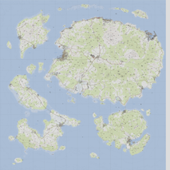
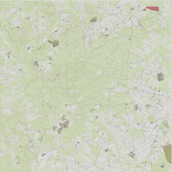
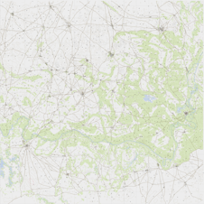
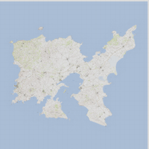

# Arma3Map
Tool to display [Arma 3](https://arma3.com/) maps in a web browser using [Leaflet](https://leafletjs.com/).

# Supported maps

| [Tanoa](tanoa.html)  | [X-CAM Taunus](taunus.html) | [Kujari](kujari.html) |
| -------------------- | --------------------------- | --------------------- |
| <a href="tanoa.html"></a> | <a href="taunus.html"></a> | <a href="kujari.html"></a> |

| [Altis](altis.html)  | 
| -------------------- | 
| <a href="altis.html"></a> | 


Content under 
- [Arma Public Licence](https://www.bohemia.net/community/licenses/arma-public-license). &copy; Bohemia Interactive, X-CAM Taunus Dev Team.
- [Arma Public Licence-Share Alike](https://www.bohemia.net/community/licenses/arma-public-license-share-alike). &copy; Temppa.

# How to use

## Base map

Each map have a js file that provides informations to configure Leaflet:
`https://jetelain.github.io/Arma3Map/maps/[mapname].js`

```html
<!DOCTYPE html>
<html lang="en">
<head>
    <meta charset="utf-8" />
    <meta name="viewport" content="width=device-width, initial-scale=1.0" />
    <title>Tanoa</title>
    <link rel="stylesheet" href="https://unpkg.com/leaflet@1.6.0/dist/leaflet.css" />
    <link rel="stylesheet" href="https://jetelain.github.io/Arma3Map/css/mapUtils.css" />
</head>
<body style=" margin:0;padding:0;border:0;">
    <div class="map" id="map" style="width:100%; height:100vh; margin:0;padding:0;border:0;">
    </div>
    <script src="https://unpkg.com/leaflet@1.6.0/dist/leaflet.js">
    </script>
	<script src="https://unpkg.com/jquery@3.5.1/dist/jquery.min.js">
    </script>
    <script src="https://jetelain.github.io/Arma3Map/js/mapUtils.js">
    </script>
    <script src="https://jetelain.github.io/Arma3Map/maps/tanoa.js">
    </script>
    <script>
    $(function () {
        var mapInfos = Arma3Map.Maps.tanoa;

        // Create map control
        var map = L.map('map', { 
            minZoom: mapInfos.minZoom, 
            maxZoom: mapInfos.maxZoom, 
            crs: mapInfos.CRS 
        });

        // Define tile layer
        L.tileLayer('https://jetelain.github.io/Arma3Map' + mapInfos.tilePattern, { 
            attribution: mapInfos.attribution, 
            tileSize: mapInfos.tileSize
        }).addTo(map);

        // Center map, and sets default zoom
        map.setView(mapInfos.center, mapInfos.defaultZoom);

        // (optional) Add grid sliders
        L.latlngGraticule().addTo(map);

        // (optional) Add a scale control
        L.control.scale({ maxWidth: 200, imperial: false }).addTo(map);

        // (optional) Add mouse grid position
        L.control.gridMousePosition().addTo(map);
    });
    </script>
</body>
</html>

```

## Leaflet

Once you have the base map, you can use all Leaflet features and plugins.

In Leaflet APIs, the latitude will be the northing in meters, and the longitude the easting in meters (x=lon, y=lat).