# Arma3Map

Tool to display [Arma 3](https://arma3.com/) maps in a web browser using [Leaflet](https://leafletjs.com/).

-----

This repository is deprecated, it's being replaced by https://github.com/jetelain/GameMapStorage/wiki.

You can still create PR on this repository, a bridge exists to import data on the new system.

-----

# Supported maps

| [Tanoa](tanoa.html)                                                                  | [X-CAM Taunus](taunus.html)                                                            | [Kujari](kujari.html)                                                                  |
| ------------------------------------------------------------------------------------ | -------------------------------------------------------------------------------------- | -------------------------------------------------------------------------------------- |
| <a href="tanoa.html"></a> | <a href="taunus.html"></a> | <a href="kujari.html"></a> |

| [Altis](altis.html)                                                                  | [Malden](malden.html)                                                                  | [Island Panthera](panthera3.html)                                                            |
| ------------------------------------------------------------------------------------ | -------------------------------------------------------------------------------------- | -------------------------------------------------------------------------------------------- |
| <a href="altis.html"></a> | <a href="malden.html">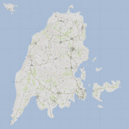</a> | <a href="panthera3.html">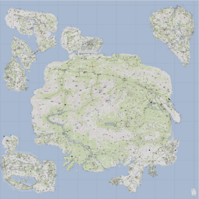</a> |

| [Livonia](enoch.html) (enoch)                                                        | [Lythium](lythium.html)                                                                  | [Virolahti - Valtatie 7](vt7.html)                                               |
| ------------------------------------------------------------------------------------ | ---------------------------------------------------------------------------------------- | -------------------------------------------------------------------------------- |
| <a href="enoch.html">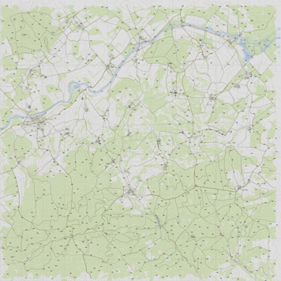</a> | <a href="lythium.html">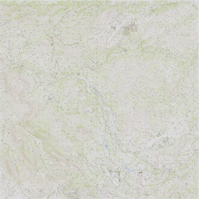</a> | <a href="vt7.html">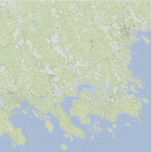</a> |

| [Stratis](stratis.html)                                                                  | [Uzbin Valley](uzbin.html)                                                           | [Anizay](tem_anizay.html)                                                                      |
| ---------------------------------------------------------------------------------------- | ------------------------------------------------------------------------------------ | ---------------------------------------------------------------------------------------------- |
| <a href="stratis.html">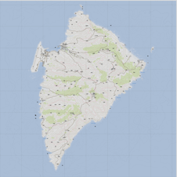</a> | <a href="uzbin.html">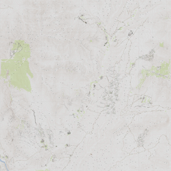</a> | <a href="tem_anizay.html">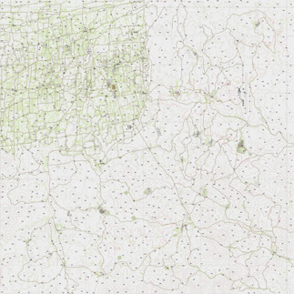</a> |

| [Pulau](pulau.html)                                                                  | [Ruha](ruha.html)                                                                  | [Suursaari](tem_suursaariv.html)                                                                       |
| ------------------------------------------------------------------------------------ | ---------------------------------------------------------------------------------- | ------------------------------------------------------------------------------------------------------ |
| <a href="pulau.html">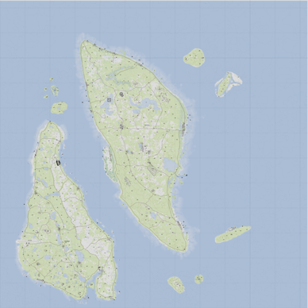</a> | <a href="ruha.html">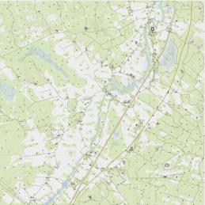</a> | <a href="tem_suursaariv.html"></a> |

| [Aliabad Region](mcn_aliabad.html)                                                               | [Hazar-Kot Valley](mcn_hazarkot.html)                                                              | [Bystrica](woodland_acr.html)                                                                      |
| ------------------------------------------------------------------------------------------------ | -------------------------------------------------------------------------------------------------- | -------------------------------------------------------------------------------------------------- |
| <a href="mcn_aliabad.html">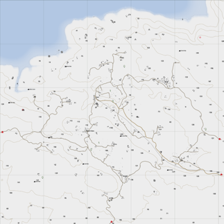</a> | <a href="mcn_hazarkot.html">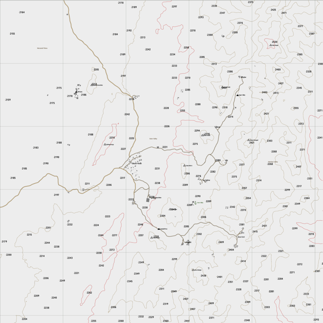</a> | <a href="woodland_acr.html">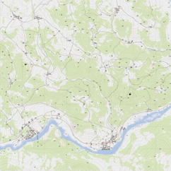</a> |

| [Chernarus (Autumn)](chernarus.html)                                                         | [Chernarus (Summer)](chernarus.html)                                                         | [Chernarus (Winter)](chernarus.html)                                                         |
| -------------------------------------------------------------------------------------------- | -------------------------------------------------------------------------------------------- | -------------------------------------------------------------------------------------------- |
| <a href="chernarus.html">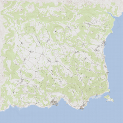</a> | <a href="chernarus.html"></a> | <a href="chernarus.html"></a> |

| [Sahrani](sara.html)                                                               | [United Sahrani](sara_dbe1.html)                                                             | [Takistan](takistan.html)                                                                  |
| ---------------------------------------------------------------------------------- | -------------------------------------------------------------------------------------------- | ------------------------------------------------------------------------------------------ |
| <a href="sara.html"></a> | <a href="sara_dbe1.html">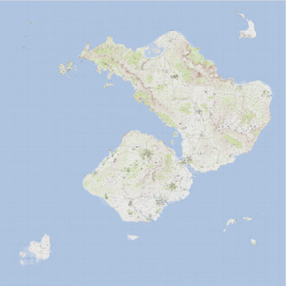</a> | <a href="takistan.html">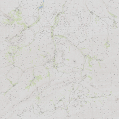</a> |

| [Takistan Mountains](mountains_acr.html)                                                             | [Zargabad](zargabad.html)                                                                  | [Everon](eden.html)                                                                |
| ---------------------------------------------------------------------------------------------------- | ------------------------------------------------------------------------------------------ | ---------------------------------------------------------------------------------- |
| <a href="mountains_acr.html">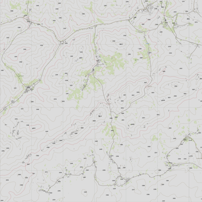</a> | <a href="zargabad.html">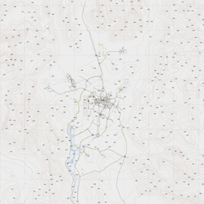</a> | <a href="eden.html">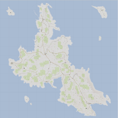</a> |

| [Chongo](chongo.html)                                                                  | [Southeast Angola](seangola.html)                                                          | [Dingor](dingor.html)                                                                  |
| -------------------------------------------------------------------------------------- | ------------------------------------------------------------------------------------------ | -------------------------------------------------------------------------------------- |
| <a href="chongo.html">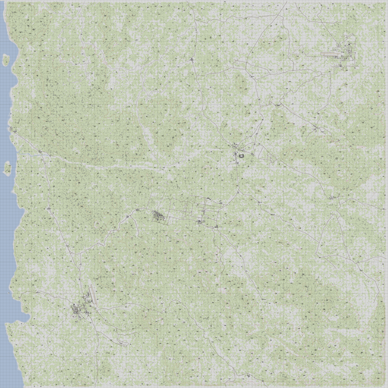</a> | <a href="seangola.html">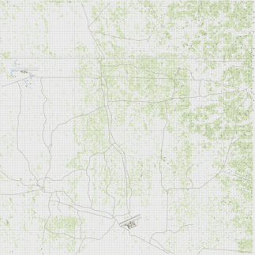</a> | <a href="dingor.html">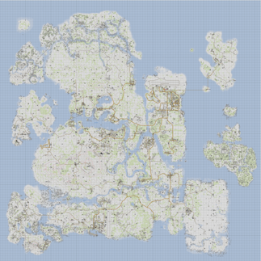</a> |

| [Lingor](lingor3.html)                                                                   | [Isla Abramia](abramia.html)                                                             | [Isla Duala](isladuala3.html)                                                                  |
| ---------------------------------------------------------------------------------------- | ---------------------------------------------------------------------------------------- | ---------------------------------------------------------------------------------------------- |
| <a href="lingor3.html">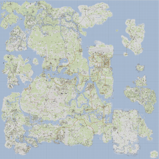</a> | <a href="abramia.html">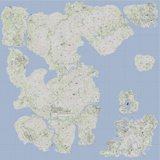</a> | <a href="isladuala3.html">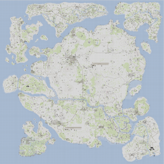</a> |

| [Clafghan](clafghan.html)                                                                  | [Diyala](dya.html)                                                               | [G.O.S Al Rayak](pja310.html)                                                          |
| ------------------------------------------------------------------------------------------ | -------------------------------------------------------------------------------- | -------------------------------------------------------------------------------------- |
| <a href="clafghan.html">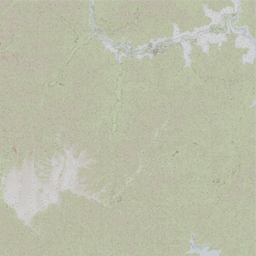</a> | <a href="dya.html">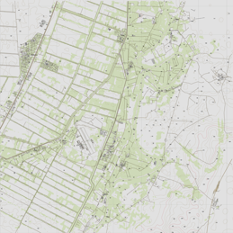</a> | <a href="pja310.html">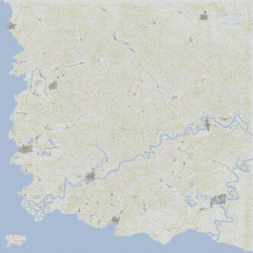</a> |

| [G.O.S Dariyah](pja307.html)                                                           | [G.O.S N'Djenahoud](pja319.html)                                                       | [G.O.S N'ziwasogo](pja305.html)                                                        |
| -------------------------------------------------------------------------------------- | -------------------------------------------------------------------------------------- | -------------------------------------------------------------------------------------- |
| <a href="pja307.html">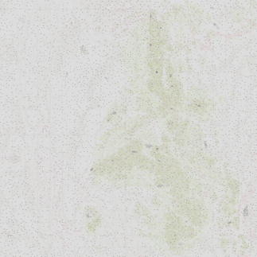</a> | <a href="pja319.html"></a> | <a href="pja305.html">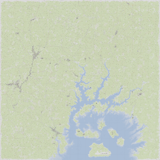</a> |

| [Khoramshahr (Beta)](khoramshahr.html)                                                           | [Kunduz, Afghanistan Lighting Revival](kunduz.html)                                    | [RHSPKL](rhspkl.html)                                                                  |
| ------------------------------------------------------------------------------------------------ | -------------------------------------------------------------------------------------- | -------------------------------------------------------------------------------------- |
| <a href="khoramshahr.html">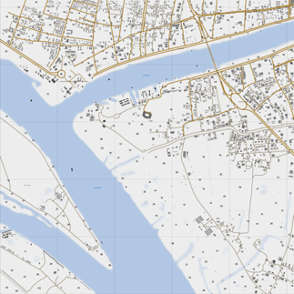</a> | <a href="kunduz.html">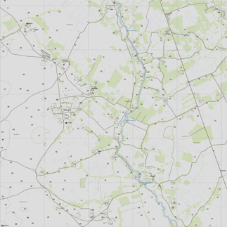</a> | <a href="rhspkl.html">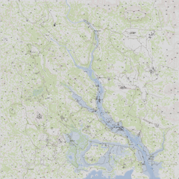</a> |

| [VT5 - Valtatie 5](vt5.html)                                                     | [Esseker](esseker.html)                                                                  | [Hindu Kush](hindukush.html)                                                                 |
| -------------------------------------------------------------------------------- | ---------------------------------------------------------------------------------------- | -------------------------------------------------------------------------------------------- |
| <a href="vt5.html">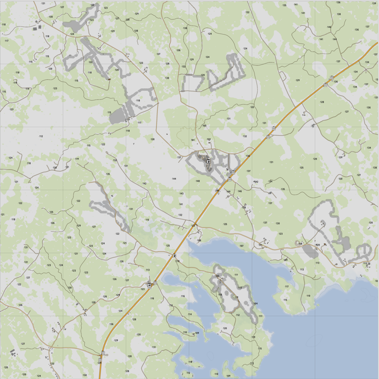</a> | <a href="esseker.html">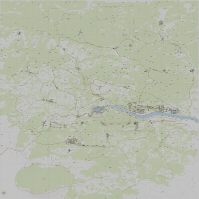</a> | <a href="hindukush.html">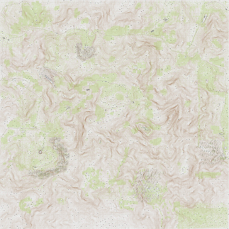</a> |

| [PR F.A.T.A](fata.html)                                                            | [Rosche, Germany](wl_rosche.html)                                                            | [Sangin.v4](sangin_distirict_helmand_province.html)                                                                                          |
| ---------------------------------------------------------------------------------- | -------------------------------------------------------------------------------------------- | -------------------------------------------------------------------------------------------------------------------------------------------- |
| <a href="fata.html">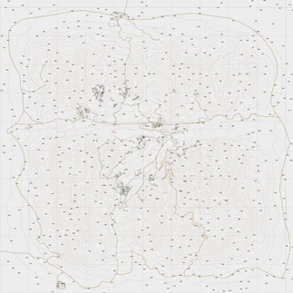</a> | <a href="wl_rosche.html">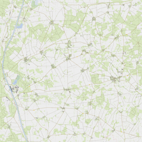</a> | <a href="sangin_distirict_helmand_province.html">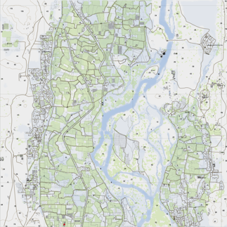</a> |

| [Yellowstone](pabst_yellowstone.html)                                                                        | [Napf Island A3](napf.html)                                                        | [NapfWinter Island A3](napfwinter.html)                                                        |
| ------------------------------------------------------------------------------------------------------------ | ---------------------------------------------------------------------------------- | ---------------------------------------------------------------------------------------------- |
| <a href="pabst_yellowstone.html">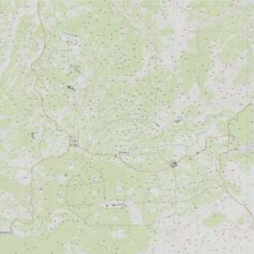</a> | <a href="napf.html">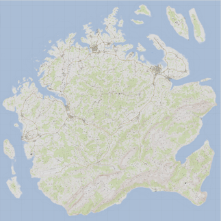</a> | <a href="napfwinter.html"></a> |

| [Chernarus 2020](cup_chernarus_a3.html)                                                                        | [Chernarus A3S](chernarus_a3s.html)                                                        | [Beketov](beketov.html)                                                        |
| ------------------------------------------------------------------------------------------------------------ | ---------------------------------------------------------------------------------- | ---------------------------------------------------------------------------------------------- |
| <a href="cup_chernarus_a3.html">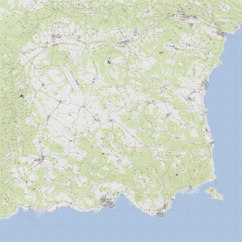</a> | <a href="chernarus_a3s.html">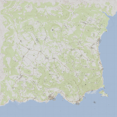</a> | <a href="beketov.html">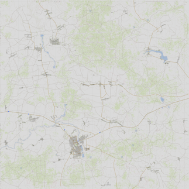</a> |

| [SOG Cam Lao Nam](cam_lao_nam.html)                                                                        | [GulfCoast](gulfcoast.html)                                                        | [Saint Kapaulio](kapaulio.html)                                                            |
| ------------------------------------------------------------------------------------------------------------ | ---------------------------------------------------------------------------------- | ------------------------------------------------------------------------------------------ | 
| <a href="cam_lao_nam.html">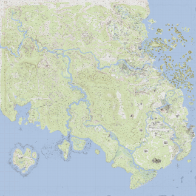</a> | <a href="gulfcoast.html">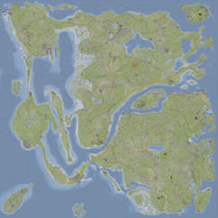</a> | <a href="kapaulio.html">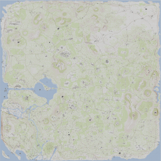</a> 

|  [Sefrouramal](sefrouramal.html)                                                                         | [Vidda](blud_vidda.html)                                                        | [Kerama](kerama.html)                                                            |
| ------------------------------------------------------------------------------------------------------------ | ---------------------------------------------------------------------------------- | ------------------------------------------------------------------------------------------ | 
| <a href="sefrouramal.html">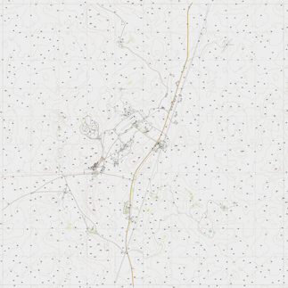</a>   | <a href="blud_vidda.html">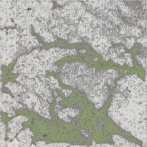</a> | <a href="kerama.html">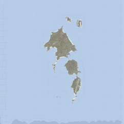</a> 

|  [Mull of Kintyre](rof_mok.html)                                                         | [Scottish Highlands](oski_corran.html)                                                            | [Deniland](deniland.html)                                                                   |
| ---------------------------------------------------------------------------------------- | ------------------------------------------------------------------------------------------------- | ------------------------------------------------------------------------------------------- |
| <a href="rof_mok.html"></a> |  <a href="oski_corran.html"></a> |  <a href="deniland.html"></a> |

| [Weferlingen](gm_weferlingen.html)                                                                     | [G.O.S Leskovets](pja314.html)                                                         | [Hellanmaa](hellanmaa.html)                                                                  |
| ------------------------------------------------------------------------------------------------------ | -------------------------------------------------------------------------------------- | -------------------------------------------------------------------------------------------- |
| <a href="gm_weferlingen.html"></a> | <a href="pja314.html"></a> | <a href="hellanmaa.html"></a> |

| [Bozcaada](bozcaada.html)                                                                  | [G.O.S Kalu Khan](pja306.html)                                                         | [UMB Colombia](umb_colombia.html)                                                                  |
| ------------------------------------------------------------------------------------------ | -------------------------------------------------------------------------------------- | -------------------------------------------------------------------------------------------------- |
| <a href="bozcaada.html"></a> | <a href="pja306.html"></a> | <a href="umb_colombia.html"></a> |

| [North Takistan](northtakistan.html)                                                                 | [Bastek](k9s_bastek.html)                                                                      | [Reshmaan Province](reshmaan.html)                                                         |
| ---------------------------------------------------------------------------------------------------- | ---------------------------------------------------------------------------------------------- | ------------------------------------------------------------------------------------------ |
| <a href="northtakistan.html"></a> | <a href="k9s_bastek.html"></a> | <a href="reshmaan.html"></a> |

| [Al Salman, Iraq](swu_public_salman_map.html)                                                                        | [MBG Celle 2](mbg_celle2.html)                                                                 | [Fapovo v1.9](fapovo.html)                                                             |
| -------------------------------------------------------------------------------------------------------------------- | ---------------------------------------------------------------------------------------------- | -------------------------------------------------------------------------------------- |
| <a href="swu_public_salman_map.html"></a> | <a href="mbg_celle2.html"></a> | <a href="fapovo.html"></a> |

| [Hebontes](hebontes.html)                                                                        | [Shapur](shapur_baf.html)                                                                 | [Southern Sahrani](saralite.html)                                                             |
| -------------------------------------------------------------------------------------------------------------------- | ---------------------------------------------------------------------------------------------- | -------------------------------------------------------------------------------------- |
| <a href="hebontes.html"></a> | <a href="shapur_baf.html"></a> | <a href="saralite.html"></a> |

| [Porto](porto.html)                                                                        | [CFB Moosehead](cfb_moosehead.html)                                                                  | [BELAVEZHSK](belavezhsk.html)                                                             |
| -------------------------------------------------------------------------------------------------------------------- | ---------------------------------------------------------------------------------------------- | -------------------------------------------------------------------------------------- |
| <a href="porto.html"></a> | <a href="cfb_moosehead.html"></a> | <a href="belavezhsk.html"></a> |

| [Shanghai - Nanjing 1937](eaw_map.html)                                                  | [Yangtze Landing Zone](eaw_village_1.html)                                                           | [Mountain Passes](eaw_mountainpasses.html)                                                                     |
| ---------------------------------------------------------------------------------------- | ---------------------------------------------------------------------------------------------------- | -------------------------------------------------------------------------------------------------------------- |
| <a href="eaw_map.html"></a> | <a href="eaw_village_1.html"></a> | <a href="eaw_mountainpasses.html"></a> |

| [Jungle Skirmish](eaw_jungleskirmish.html)                                                                     | [Niakala](juju_kalahari.html)                                                                        | [Rut Mandol](jrut_mandol.html)                                                                 |
| -------------------------------------------------------------------------------------------------------------- | ---------------------------------------------------------------------------------------------------- | ---------------------------------------------------------------------------------------------- |
| <a href="eaw_jungleskirmish.html"></a> | <a href="juju_kalahari.html"></a> | <a href="rut_mandol.html"></a> |

| [Šumava](brf_sumava.html)                                                                      | [Fallujah 2.0](fallujah.html)                                                              | [Armavir](umb_armavir.html)                                                                      |
| ---------------------------------------------------------------------------------------------- | ------------------------------------------------------------------------------------------ | ------------------------------------------------------------------------------------------------ |
| <a href="brf_sumava.html"></a> | <a href="fallujah.html"></a> | <a href="umb_armavir.html"></a> |

| [Albasrah](albasrah.html)                                                                      | [Archipelago ](archipelago.html)                                                              | [Wake Island](wake.html)                                                                      |
| ---------------------------------------------------------------------------------------------- | ------------------------------------------------------------------------------------------ | ------------------------------------------------------------------------------------------------ |
| <a href="albasrah.html"></a> | <a href="archipelago.html"></a> | <a href="wake.html"></a> |

| [Tembelan Island](tembelan.html)                                                                      | [Diego Garcia](tps_diegogarcia.html)                                                              | [Senkaku Islands 2035](senkakuislands_2035.html)                                                                      |
| ---------------------------------------------------------------------------------------------- | ------------------------------------------------------------------------------------------ | ------------------------------------------------------------------------------------------------ |
| <a href="tembelan.html"></a> | <a href="tps_diegogarcia.html"></a> | <a href="senkakuislands_2035.html"></a> |

| [BETA-42m Bovington Test Area](rksla3_t_bov_test_area.html)                                                            | [UKAF BATUS 40km](ukaf_batus.html)                                                             | [Mutambara](swu_public_rhode_map.html)                                                                             |
| ---------------------------------------------------------------------------------------------------------------------- | ---------------------------------------------------------------------------------------------- | ------------------------------------------------------------------------------------------------------------------ |
| <a href="rksla3_t_bov_test_area.html"></a> | <a href="ukaf_batus.html"></a> | <a href="swu_public_rhode_map.html"></a> |

| [SOG Khe San](vn_khe_san.html)                                                                 | [SOG The Bra](vn_the_bra.html)                                                                 | [Pecher](cartercity.html)                                                                      |
| ---------------------------------------------------------------------------------------------- | ---------------------------------------------------------------------------------------------- | ---------------------------------------------------------------------------------------------- |
| <a href="vn_khe_san.html"></a> | <a href="vn_the_bra.html"></a> | <a href="cartercity.html"></a> |


Content under

- [Arma Public Licence](https://www.bohemia.net/community/licenses/arma-public-license). &copy; Bohemia Interactive.
- Taunus: [Arma Public Licence](https://www.bohemia.net/community/licenses/arma-public-license). &copy; X-CAM Taunus Dev Team.
- Kujari: [Arma Public Licence-Share Alike](https://www.bohemia.net/community/licenses/arma-public-license-share-alike). &copy; Temppa.
- Lythium : Unspecified Licence. &copy; GreenBeret &amp; FFAA MOD Team.
- Virolahti - Valtatie 7: [Arma Public Licence-Share Alike](https://www.bohemia.net/community/licenses/arma-public-license-share-alike). &copy; furean.
- Uzbin Valley : Unspecified Licence. &copy; Dark, Max.
- Anizay: [Arma Public License Share Alike](https://www.bohemia.net/community/licenses/arma-public-license-share-alike). &copy; Temppa.
- Pulau: [Arma Public License Share Alike](https://www.bohemia.net/community/licenses/arma-public-license-share-alike). &copy; Temppa.
- Ruha: [Arma Public License Share Alike](https://www.bohemia.net/community/licenses/arma-public-license-share-alike). &copy; Temppa.
- Suursaari: [Arma Public License Share Alike](https://www.bohemia.net/community/licenses/arma-public-license-share-alike). &copy; Temppa.
- Aliabad Region: Unspecified Licence. &copy; Santa Fe.
- Hazar-Kot Valley: Unspecified Licence. &copy; Santa Fe.
- Bystrica: [Arma Public License Share Alike](https://www.bohemia.net/community/licenses/arma-public-license-share-alike). &copy; CUP Team.
- Chernarus (Autumn): [Arma Public License Share Alike](https://www.bohemia.net/community/licenses/arma-public-license-share-alike). &copy; CUP Team.
- Chernarus (Winter): [Arma Public License Share Alike](https://www.bohemia.net/community/licenses/arma-public-license-share-alike). &copy; CUP Team.
- Chernarus (Summer): [Arma Public License Share Alike](https://www.bohemia.net/community/licenses/arma-public-license-share-alike). &copy; CUP Team.
- Chernarus 2020: [Arma Public License Share Alike](https://www.bohemia.net/community/licenses/arma-public-license-share-alike). &copy; CUP Team.
- Chernarus A3S: Unspecified License. &copy; Hungry?.
- Sahrani: [Arma Public License Share Alike](https://www.bohemia.net/community/licenses/arma-public-license-share-alike). &copy; CUP Team.
- United Sahrani: [Arma Public License Share Alike](https://www.bohemia.net/community/licenses/arma-public-license-share-alike). &copy; CUP Team.
- Takistan: [Arma Public License Share Alike](https://www.bohemia.net/community/licenses/arma-public-license-share-alike). &copy; CUP Team.
- Takistan Mountains: [Arma Public License Share Alike](https://www.bohemia.net/community/licenses/arma-public-license-share-alike). &copy; CUP Team.
- Zargabad: [Arma Public License Share Alike](https://www.bohemia.net/community/licenses/arma-public-license-share-alike). &copy; CUP Team.
- Everon: [Arma Public License Share Alike](https://www.bohemia.net/community/licenses/arma-public-license-share-alike). &copy; CUP Team.
- Chongo: Unspecified License. &copy; IceBreakr.
- Southeast Angola: Unspecified License. &copy; IceBreakr.
- Dingor: Unspecified License. &copy; IceBreakr.
- Lingor: Unspecified License. &copy; IceBreakr.
- Isla Abramia: Unspecified License. &copy; IceBreakr.
- Isla Duala: Unspecified License. &copy; IceBreakr.
- Clafghan: Unspecified License. &copy; Nremik.
- Diyala: Unspecified License. &copy; CypeRevenge.
- G.O.S Al Rayak: Unspecified License. &copy; GOS_Makhno.
- G.O.S Dariyah: Unspecified License. &copy; GOS_Makhno.
- G.O.S N'Djenahoud: Unspecified License. &copy; GOS_Makhno.
- G.O.S N'ziwasogo: Unspecified License. &copy; GOS_Makhno.
- Khoramshahr (Beta): Unspecified License. &copy; War is Hell
- Kunduz, Afghanistan Lighting Revival: Unspecified License. &copy; pvttunt.
- RHSPKL: [Attribution-NonCommercial-NoDerivatives 4.0 International](https://creativecommons.org/licenses/by-nc-nd/4.0/legalcode). &copy; Red Hammer Studios.
- VT5 - Valtatie 5: Unspecified License. &copy; Tonto-.
- Esseker: Unspecified License. &copy; RonhillUltra.
- Hindu Kush: Unspecified License. &copy; CPL.Variable.A.
- PR F.A.T.A: Unspecified License. &copy; Minimalaco &amp; Robster, ported by Androkiller™.
- Rosche, Germany: [Arma Public License Share Alike](https://www.bohemia.net/community/licenses/arma-public-license-share-alike). &copy; WA Lancer.
- Sangin.v4: Unspecified License. &copy; SmokeDog.
- Yellowstone: Unspecified License. &copy; PabstMirror.
- Napf Island: Unspecified License. &copy; Momo & ANixon.
- Napf Island (winter): Unspecified License. &copy; Momo & ANixon.
- Beketov: Unspecified License. &copy; Dead_Kennedy, SenChi.
- Saint Kapaulio: [EULA](https://steamcommunity.com/sharedfiles/filedetails/?id=939686262). &copy; {God-father}.
- Mull of Kintyre: Unspecified License. &copy; Ice.
- Scottish Highlands: Unspecified License. &copy; Big Jim.
- Deniland: Unspecified License. &copy; Marko.
- G.O.S Leskovets: Unspecified License. &copy; GOS_Makhno.
- Hellanmaa: Unspecified License. &copy; Temppa.
- Bozcaada: Unspecified License. &copy; Cirav.
- G.O.S Kalu Khan: Unspecified License. &copy; GOS_Makhno.
- UMB Colombia: Unspecified License. &copy; 77th JSOC.
- North Takistan: Unspecified License. &copy; Rezlind.
- Al Salman, Iraq: Unspecified License. &copy; swurvin.
- Reshmaan Province: Unspecified License. &copy; 3CB.
- Bastek: [Arma Public License Share Alike](https://www.bohemia.net/community/licenses/arma-public-license-share-alike). &copy; Vectif.
- MBG Celle 2: Unspecified License. &copy; Mondkalb.
- Fapovo v1.9: Unspecified License. &copy; IceBreakr.

# How to use

## Base map

Each map have a js file that provides informations to configure Leaflet:
`https://jetelain.github.io/Arma3Map/maps/[mapname].js`

Alternate CDN (OVH Cloud hosted) : `https://mapsdata.plan-ops.fr/maps/[mapname].js`

```html
<!DOCTYPE html>
<html lang="en">
  <head>
    <meta charset="utf-8" />
    <meta name="viewport" content="width=device-width, initial-scale=1.0" />
    <title>Tanoa</title>
    <link
      rel="stylesheet"
      href="https://unpkg.com/leaflet@1.6.0/dist/leaflet.css"
    />
    <link
      rel="stylesheet"
      href="https://jetelain.github.io/Arma3Map/css/mapUtils.css"
    />
  </head>
  <body style=" margin:0;padding:0;border:0;">
    <div
      class="map"
      id="map"
      style="width:100%; height:100vh; margin:0;padding:0;border:0;"
    ></div>
    <script src="https://unpkg.com/leaflet@1.6.0/dist/leaflet.js"></script>
    <script src="https://unpkg.com/jquery@3.5.1/dist/jquery.min.js"></script>
    <script src="https://jetelain.github.io/Arma3Map/js/mapUtils.js"></script>
    <script src="https://jetelain.github.io/Arma3Map/maps/tanoa.js"></script>
    <script>
      $(function () {
        var mapInfos = Arma3Map.Maps.tanoa;

        // Create map control
        var map = L.map("map", {
          minZoom: mapInfos.minZoom,
          maxZoom: mapInfos.maxZoom,
          crs: mapInfos.CRS,
        });

        // Define tile layer
        L.tileLayer(
          "https://jetelain.github.io/Arma3Map" + mapInfos.tilePattern,
          {
            attribution: mapInfos.attribution,
            tileSize: mapInfos.tileSize,
          }
        ).addTo(map);

        // Center map, and sets default zoom
        map.setView(mapInfos.center, mapInfos.defaultZoom);

        // (optional) Add grid sliders
        L.latlngGraticule().addTo(map);

        // (optional) Add a scale control
        L.control.scale({ maxWidth: 200, imperial: false }).addTo(map);

        // (optional) Add mouse grid position
        L.control.gridMousePosition().addTo(map);
      });
    </script>
  </body>
</html>
```

## Leaflet

Once you have the base map, you can use all Leaflet features and plugins.

In Leaflet APIs, the latitude will be the northing in meters, and the longitude the easting in meters (x=lon, y=lat).

# How to help

- [Export map for Arma3Map](HowToExport.md)

# See also

My projects powered by Arma3Map :

- https://maps.plan-ops.fr/ : Prepare tactical maps, share them in real time, and import them into Arma 3 (you can host your own server using https://github.com/jetelain/Arma3TacMap)
- https://ctab.plan-ops.fr/ : Commander tablet in real time on your mobile device. Extension of the cTab mod (https://github.com/jetelain/cTab)
